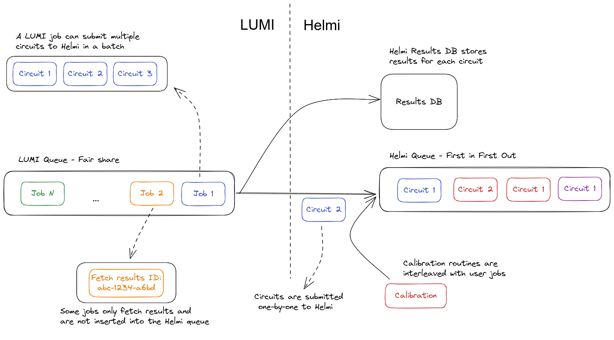
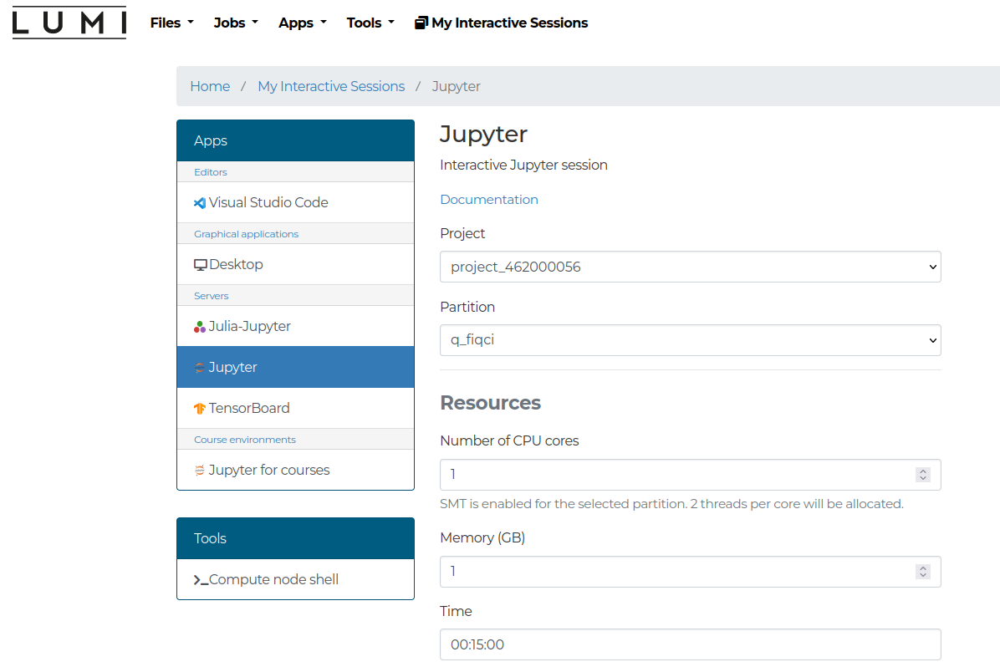
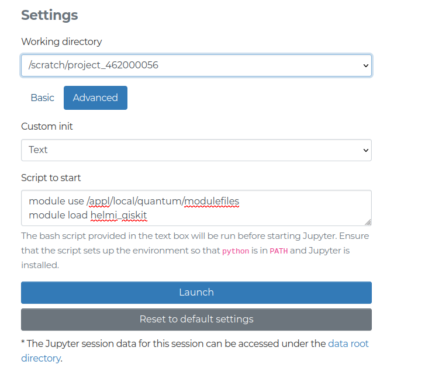

# Running on Helmi

To run interactive jobs on LUMI the [`srun`](https://slurm.schedmd.com/srun.html) command can be used

```bash
srun --account=project_<id> -t 0:02:00 -c 1 -n 1 --partition q_industry python qiskit_flip.py
```

The command takes a number of arguments

- `--account`: Unix group string which can be found in your [MyCSC](https://my.csc.fi/dashboard) project.
- `-t`: Sets a limit on total run time of job allocation. **Upper bound is 15 minutes**.
- `-c`: Requests that $n$ CPUs be allocated per process.
- `-n`: Number of tasks to run in parallel. If greater than 1, a job may be assigned to multiple nodes.
- `--partition`: The partition to run on. Should be `q_industry`.
- `cmd`: The command to run. In this case `python qiskit_flip.py`


Note, that the `srun` command is blocking, which means that you'll have to wait until your program terminates before `srun` returns and you can enter your next command. Alternatively you can also load a shell on the compute node to provide more flexibility. This can be done with the following command:


```bash
srun --account=project_<id> -t 0:15:00 -c 1 -n 1 --partition q_industry --pty bash
```

This command loads a bash shell on the compute node with access to Helmi. After getting the shell, you may need to load your modules again.

!!! note

    The LUMI Web-interface is now available at [www.lumi.csc.fi](https://www.lumi.csc.fi). You can run jupyter-notebooks through this web interface. [See the section below for further details](#web-interface).

To run longer experiments, it is advisable to use [`sbatch`](https://slurm.schedmd.com/sbatch.html) which executes batch jobs on LUMI.

```bash
#!/bin/bash

#SBATCH --job-name=helmijob     # Job name
#SBATCH --account=project_<id>  # Project for billing
#SBATCH --partition=q_industry  # Partition (queue) name
#SBATCH --ntasks=1              # One task (process)
#SBATCH --cpus-per-task=1       # Number of cores (threads)
#SBATCH --time=00:15:00         # Run time (hh:mm:ss)

module use /appl/local/quantum/modulefiles

# uncomment correct line:
# module load helmi_qiskit
# or
# module load helmi_cirq

python your_python_script.py
```


## Job queues

Running on Helmi through LUMI involves using two queues. The first one is the [SLURM](https://slurm.schedmd.com/documentation.html) queue on LUMI. Users interact with SLURM using the `srun` or `sbatch` commands for job submission and can fetch details about the queue state using `squeue -p <partition>`. The state of the partition can be viewed with `sinfo -p <partition>`.

Jobs on LUMI have the following limitations

- **Maximum duration for any job is 15 minutes**
- **Maximum of 32 cores**

After your job is accepted by LUMI, it will be allocated to a node within the `q_industry` partition. At present, the `nid002153` node is available for use, which is equipped with 128 CPU cores and 256 GiB of memory.

!!! note

    For additional information:

    - To check the `q_industry` partition's current limits and the list of nodes, use `sinfo -s q_industry`.
    - To obtain information about the node `nid002153`, use `scontrol show node "nid002153"`.

The second queue is Helmi's internal job queue. It consists of a simple first-in-first-out (FIFO) queue. Each job from LUMI that executes a quantum circuit on Helmi will be inserted into this queue. It's important to note that operations that retrieve data, such as shot results or calibration data, do not enter this queue. Furthermore, periodic calibration jobs, submitted from VTT's side, are interleaved with regular user jobs in Helmi's queue (see [Calibration](calibration.md)) as depicted in the picture below.



## Web-interface

The [LUMI Web interface](https://www.lumi.csc.fi) allows users to run on Helmi through their browser and use Jupyter notebooks for execution. Here is a brief guide, specifically for Helmi, however further details can be found [here](https://docs.csc.fi/computing/webinterface/).

Once you have logged in select the `Jupyter` option. The session should be configured by selecting your project and the partition. The partitions should be `q_fiqci` and  `q_industry` for use with Helmi. The resource limitations are described [here](limitations.md). For use with Helmi some custom advanced settings should be configured.

```bash
module use /appl/local/quantum/modulefiles
module load helmi_qiskit
```

This pictures below demonstrate the process.




