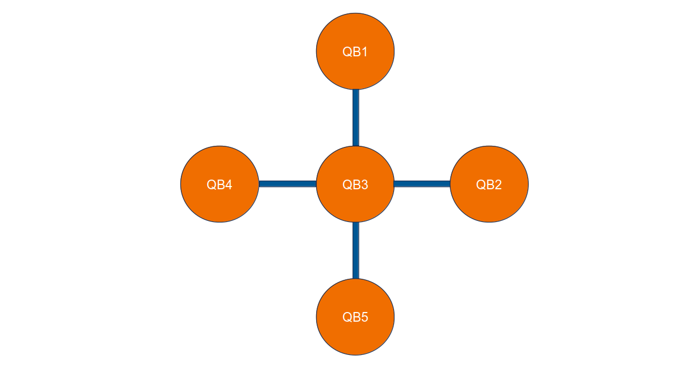

# VTT Q5 "Helmi"

VTT Q5 is a 5 qubit superconducting quantum computer computer co-developed and built by IQM and VTT. It uses flux-tunable qubits and couplers which are described in this paper[^1].

Helmi's qubits are arranged in a star-shaped topology, meaning that the central qubit, *QB3*, is connected to all of the outer qubits, *QB1, QB2, QB4*. Two-qubit gates can be applied only between the central qubit and the outer qubits.

VTT Q5 star-shaped topology

The qubits are pairwise connected with tunable couplers.

## Native-gate set

To run arbitrary quantum circuits, a QPU needs to implement a universal gate set. Helmi implements the following gates natively:

- Single-qubit gates: Phased-$RX$ gate (PRX)
- Two-qubit gate: Controlled-$Z$ gate (CZ)

Measurements are natively implemented as single-qubit measurements in the $Z$ basis.

## Characteristics

The values below are averaged values. Actual values might differ from day-to-day.

|                                      | QB1  | QB2  | QB3  | QB4  | QB5  |
| ------------------------------------ | ---- | ---- | ---- | ---- | ---- |
| Drive Frequencies [GHz]              | 4.4  | 3.9  | 4.2  | 4.4  | 4.4  |
| Readout Frequencies [GHz]            | 5.3  | 5.0  | 6.2  | 5.9  | 5.6  |
| T1 time [µs]                         | 35.5 | 25.7 | 40.2 | 41.3 | 36.0 |
| T2 time [µs]                         | 19.2 | 17.7 | 9.12 | 19.1 | 22.2 |
| T2 echo time [µs]                    | 45.2 | 33.1 | 26.5 | 47.7 | 35.0 |
| Single-Qubit Gate Fidelities[^2] [%] | 99.4 | 99.7 | 99.7 | 99.6 | 99.7 |
| Readout Fidelities [%]               | 96   | 95   | 95   | 95   | 95   |

The coupler characteristics are given below. TC refers to tunable coupler.

|                                   | TC-3-1 | TC-3-2 | TC-3-4 | TC-3-5 |
| --------------------------------- | ------ | ------ | ------ | ------ |
| Two-qubit Gate Fidelities[^3] [%] | 96.4   | 95.9   | 94.6   | 97.5   |

The PRX gate length and the CZ gate length is 120 [ns] respectively.

[^1]: [*Long-Distance Transmon Coupler with cz-Gate Fidelity above 99.8%, Marxer et al.*](https://doi.org/10.1103/PRXQuantum.4.010314)
[^2]: Calculated via randomized benchmarking
[^3]: CZ gate fidelity calculated via interleaved randomized benchmarking
